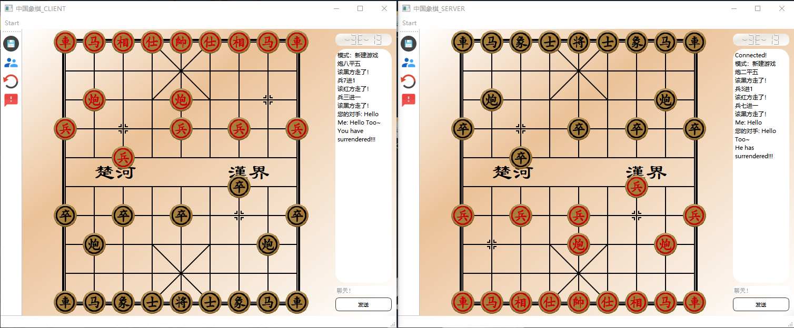
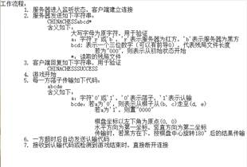
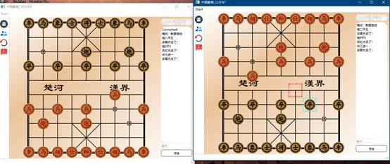
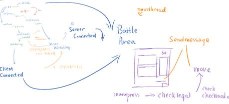
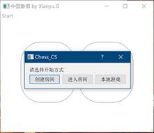

# Chinese chess network-platform

- Developed by QT creator in one week
- 2018 Tsinghua University summer semester course, Programing and Training's project

## Features

- Support both network mode and local mode
- An online chatting system inside
- Background music
- User-friendly design 

## Dependency

- Dependency can be found in Chess_CS.pro

# 第二周大作业报告

### 一、     程序主要特色

1. 遵循tty同学所写的一份协议，通过使用同一套落子、认输的信息，可以实现在不同的程序上进行对战，对方不一定需要用我的程序。

我对于协议结合我自己的程序做了小幅增加，比如我的程序支持聊天功能，在字符串传送的时候再加一个‘3’，再传输。

2. 

支持聊天功能，落子信息的信息显示。

设置好在网络对战的过程中只有房主才可以保存文件（只有房主才可以发送残局），同时关闭了读档接口，游戏过程不得读档。离线模式可以随时读档。

3. 单独加了一个thread播放bgm，同时落子，落子非法都有声音，声音比较动感，具有良好的游戏体验

4. 当对方关闭程序的时候会提示CONNECTION LOST,并且会自动进入单机模式（客户端的单机模式会出现方向的问题，兵会倒着跑，可以自娱自乐），服务器端可以自动进行单机模式

5. 专门为游戏放置了一个线程用于播放背景音乐，而且音效非常带感

 

### 二、     程序设计思路

​       这是个一个非常大的流程图

​       整个程序主要分为两个大类，MainWindow和BattleArea，其中MainWindow里面有不同的对话框，用于不同阶段的选择，以及接受信息等等。BattleArea整合了判断将军，判断下棋合法，移动，这样的函数，同时也包括聊天框，处理信息等等。

 

 

​              

可以选择模式，创建房间之后随机生成端口（initServer()），接下来服务器开始监听，同时根据协议整合一个字符串CHINACHESSabcd用于验证信息以及传输残局情况。此时客户端程序也开始连接，如果连接上了，那么客户端会首先显示BattleArea(也就是作战窗口)，其次客户端会向服务器端再传送一个CHINACHESSSUCCESS这样的字符串，服务器验证完毕之后即可进入程序。

 

​       BattleArea整合了下棋相关的逻辑。（棋盘是根据坐标自己画上去的）。重载了mousemoveevent，用于预览当前鼠标选择区域。重载了mousepressevent，当鼠标点击的时候会显示不同状态，选中，或是走棋无效，或是走棋。如果是选中状态，那么调用check_if_move_legal来判断是否移动合法，移动之后再调用check_if_checkmate来判断是否将军。不同的状态会激发不同的信号，与playaudio这样的槽结合起来播放音效。

​       每当移动一步的时候，将信息传送给聊天框，同时将信息进行包装，比如如果正常落子，那么就是0xxxx，如果是投降，那么就是1xxxx，如果是聊天信息，那么就是3xxxx。

​       将信息发送给Mainwindow的SendMessage槽，发送信息。当Mainwindow收到信息，再传送给BattleArea的getString槽处理相关信息，如果是该对方了，那么处理完信息之后再调用moveto函数进行落子。

 

 

### 三、     存在的问题以及反思

1. 程序中没有使用多线程，我觉得比如判断将军，判断移动合法可以移动到多线程里面去计算，但是具体操作是什么，怎么传参这样的问题我还没有尝试过，可能是设置友元？由于乱七八糟写的东西有点多这个东西没有来得及尝试。

2. 代码感觉有点长有点复杂，虽然我尽量把一些有规律性的东西写到了一块，但是由于同时有本地模式还有在线模式，而且在线模式的时候如果是黑方的话还会在下面，这样处理坐标的时候还要额外考虑，代码实在是有点长…。不过我认为我在接口的复用性上做的还是可以的，不管是服务器、客户端还是本地模式，判断将军，以及加载存档等等都是使用的同一套接口。

 

3. 感觉类有点少，我把所有的逻辑都扔到了同一个BattleArea里面，上学期OOP大作业的时候我是该分开的都分开了。这样可能有利有弊吧，我自己写代码的时候会容易一些，因为毕竟传送的时候如果有太多的信号和类可能会造成混乱，但是阅读起来可能会比较困难。

 

4. 网络有点困难，很多时候程序不会按预想的情况来，QT的事件还有网络的这些机制有点复杂，但是万幸最终实现的效果还算差强人意。
